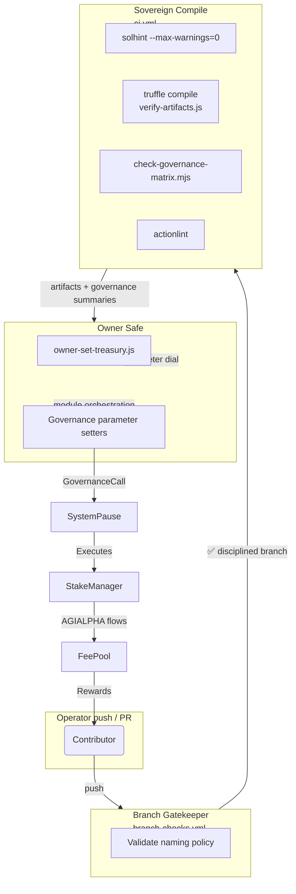
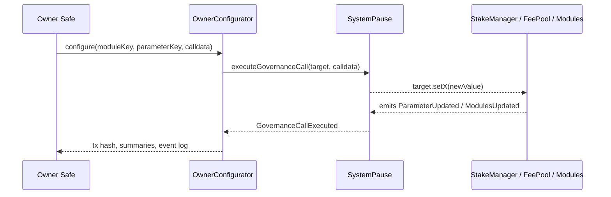
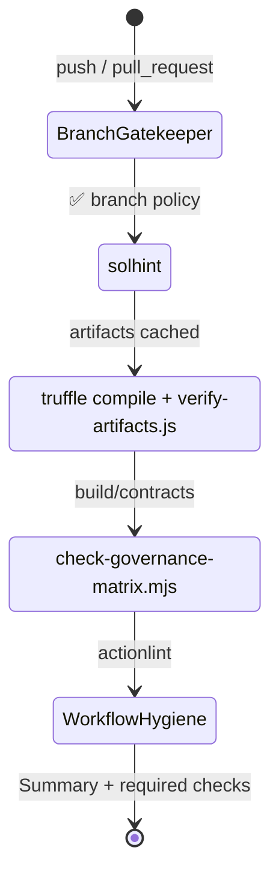

# Sovereign Labor Automation Conductor

[](https://github.com/MontrealAI/agijobs-sovereign-labor-v0p1/actions/workflows/ci.yml)
[](https://github.com/MontrealAI/agijobs-sovereign-labor-v0p1/actions/workflows/branch-checks.yml)
[](https://nodejs.org/)
[](https://trufflesuite.com/)
[](https://docs.soliditylang.org/)
[](../LICENSE)
[](https://etherscan.io/token/0xa61a3b3a130a9c20768eebf97e21515a6046a1fa)

The `scripts/` lattice is the composable command center that keeps the Sovereign Labor platform perfectly aligned with the owner Safe. Every utility enforces one more invariant so staking treasuries, governance matrices, deployment artifacts, and the immutable $AGIALPHA token at `0xa61a3b3a130a9c20768eebf97e21515a6046a1fa` (18 decimals) remain synchronized. This repository is the wealth-compounding automation machine described in the project brief; the utilities below guarantee it stays unstoppable, operator-friendly, and continuously auditable.

These workflows **must** remain green and required:

- **Sovereign Compile** (`ci.yml`) – lint, compile, verify, and audit every governance surface before artifacts ship.
- **Branch Gatekeeper** (`branch-checks.yml`) – disallows undisciplined branch names from entering the review surface.

Enable required status checks, required reviews, administrator enforcement, and the "require branches to be up to date" switch on `main`, `develop`, and every protected branch so merges cannot bypass the automation covenant.

---

## Table of contents

1. [Systems atlas](#systems-atlas)
2. [Launch checklist](#launch-checklist)
3. [Script playbook](#script-playbook)
4. [Control surface choreography](#control-surface-choreography)
5. [Continuous integration covenant](#continuous-integration-covenant)
6. [Owner prerogatives](#owner-prerogatives)
7. [Observability and telemetry](#observability-and-telemetry)
8. [Diagnostics matrix](#diagnostics-matrix)
9. [Extending the lattice](#extending-the-lattice)

---

## Systems atlas



Every run writes GitHub Step Summaries so reviewers, auditors, and the owner Safe see precisely what changed, which modules were touched, and how the economic rails react. No unchecked drift reaches production.

---

## Launch checklist

```bash
npm ci --omit=optional --no-audit --no-fund
npm run lint:sol
npm run compile
node scripts/verify-artifacts.js
node scripts/check-governance-matrix.mjs
```

> **Recommendation:** Execute the full checklist locally before opening a PR. Console tables emitted by the scripts mirror the CI job summaries, so any discrepancy is obvious.

---

## Script playbook

| Script | Surface | Guarantees | Usage |
| --- | --- | --- | --- |
| [`check-branch-name.mjs`](check-branch-name.mjs) | Branch hygiene | Enforces `main`, `develop`, or `<type>/<descriptor>` with curated types (`feature`, `release`, `docs`, `dependabot`, `renovate`, `codex`, …). Writes GitHub Step Summaries and fails fast on invalid characters. | `node scripts/check-branch-name.mjs "feature/treasury-upgrade"` |
| [`verify-artifacts.js`](verify-artifacts.js) | Compile surface | Confirms Truffle artifacts exist for production contracts, contain non-empty bytecode, were compiled with `solc 0.8.30`, and are fresher than their Solidity sources. Emits a Markdown size table for gas analysts. | `node scripts/verify-artifacts.js` |
| [`write-compile-summary.js`](write-compile-summary.js) | Toolchain telemetry | Captures Node.js, npm, Truffle, and Solidity versions plus the evaluated branch and runner OS. Appends the information to the job summary for audit trails. | `node scripts/write-compile-summary.js` *(executed automatically in CI)* |
| [`check-governance-matrix.mjs`](check-governance-matrix.mjs) | Governance lattice | Parses `build/contracts` ABIs to ensure every owner + pauser function remains available on `SystemPause`, `StakeManager`, `JobRegistry`, `ValidationModule`, `DisputeModule`, `PlatformRegistry`, `FeePool`, `ReputationEngine`, and `ArbitratorCommittee`. Verifies `$AGIALPHA` constants and decimals (`18`) match [`contracts/Constants.sol`](../contracts/Constants.sol) and [`deploy/config.mainnet.json`](../deploy/config.mainnet.json). | `node scripts/check-governance-matrix.mjs` *(after `npm run compile`)* |
| [`owner-set-treasury.js`](owner-set-treasury.js) | Treasury rotation | Allows the owner Safe (via `OwnerConfigurator`) to rotate the `StakeManager` treasury through `SystemPause.executeGovernanceCall`. Emits transaction hash plus `ParameterUpdated` events so the change is fully auditable. | `NEW_TREASURY=0xYourSafe node scripts/owner-set-treasury.js` |

---

## Control surface choreography



The automation suite affirms that the contract owner can reconfigure every critical parameter without leaving the Safe:

- **Treasury & routing controls:** `StakeManager.setTreasury`, `StakeManager.setFeePool`, `StakeManager.setTreasuryAllowlist`, `FeePool.setTreasury`, `FeePool.setTreasuryAllowlist`, `FeePool.setRewarder`.
- **Pausing:** `SystemPause.pauseAll` / `unpauseAll`, plus individual module `pause` / `unpause` functions surfaced in the governance matrix.
- **Module wiring:** `setGovernance`, `setTaxPolicy`, `setValidationModule`, `setDisputeModule`, `setIdentityRegistry`, `setReputationEngine`, `setCommittee`, and more—each checked by `check-governance-matrix.mjs`.
- **Ownership discipline:** Every core contract exposes `transferOwnership` and `owner()`; the scripts fail if any of these signatures disappear.

Extend `owner-set-treasury.js` by swapping `moduleKey`, `parameterKey`, and calldata encoders to target any other setter. The owner retains absolute command over configuration, routing, and circuit-breakers while the public interfaces stay immutable.

---

## Continuous integration covenant



| Workflow | Job | Purpose | Required status check name |
| --- | --- | --- | --- |
| [`ci.yml`](../.github/workflows/ci.yml) | `Solidity lint` | Executes `npm run lint:sol` with zero-warning policy. | `Solidity lint` |
|  | `Compile smart contracts` | Runs `npm run compile`, `verify-artifacts.js`, uploads `build/contracts`, and publishes compile telemetry. | `Compile smart contracts` |
|  | `Governance surface audit` | Executes `npm run ci:governance` (alias of `check-governance-matrix.mjs`) to verify owner/pauser control and `$AGIALPHA` invariants. | `Governance surface audit` |
|  | `Workflow hygiene` | Invokes `actionlint` on the repo to ensure workflow correctness. | `Workflow hygiene` |
| [`branch-checks.yml`](../.github/workflows/branch-checks.yml) | `Validate branch naming conventions` | Blocks ill-formed branches from entering review or `main`. | `Validate branch naming conventions` |

**Enforcement ritual:**

1. Enable **Require status checks to pass before merging** with every check above selected and marked **Required**.
2. Enable **Require branches to be up to date before merging** so the compiled artifacts match `main` at merge time.
3. Enable **Require a pull request before merging** and **Require approvals** to keep human and automated guardians aligned.
4. Enable **Include administrators** so no privileged merge can bypass the safety lattice.
5. Optionally restrict merge methods (squash / rebase) if the governance board demands immutable history—CI summaries remain intact either way.

---

## Owner prerogatives

| Module | Privileges guaranteed | Source |
| --- | --- | --- |
| `SystemPause` | `pauseAll`, `unpauseAll`, `refreshPausers`, `setModules`, `setGlobalPauser`, `executeGovernanceCall`, `transferOwnership`, `owner` | [`contracts/SystemPause.sol`](../contracts/SystemPause.sol) |
| `StakeManager` | `setFeePool`, `setDisputeModule`, `setValidationModule`, `setJobRegistry`, `setTreasury`, `setTreasuryAllowlist`, `setRoleMinimums`, `applyConfiguration`, `pause`, `unpause`, `transferOwnership`, `owner` | [`contracts/StakeManager.sol`](../contracts/StakeManager.sol) |
| `FeePool` | `setTreasury`, `setTreasuryAllowlist`, `setRewarder`, `setTaxPolicy`, `setGovernance`, `setStakeManager`, `pause`, `unpause`, `transferOwnership`, `owner` | [`contracts/FeePool.sol`](../contracts/FeePool.sol) |
| `JobRegistry` | `setJobParameters`, `setTaxPolicy`, `setStakeManager`, `setIdentityRegistry`, `setValidationModule`, `setDisputeModule`, `setFeePool`, `applyConfiguration`, `pause`, `unpause`, `transferOwnership`, `owner` | [`contracts/JobRegistry.sol`](../contracts/JobRegistry.sol) |
| `ValidationModule` | `setStakeManager`, `setIdentityRegistry`, `setReputationEngine`, `setSelectionStrategy`, `setRandaoCoordinator`, `pause`, `unpause`, `transferOwnership`, `owner` | [`contracts/ValidationModule.sol`](../contracts/ValidationModule.sol) |
| `DisputeModule` | `setCommittee`, `setTaxPolicy`, `setDisputeFee`, `setDisputeWindow`, `pause`, `unpause`, `setPauser`, `setPauserManager`, `transferOwnership`, `owner` | [`contracts/modules/DisputeModule.sol`](../contracts/modules/DisputeModule.sol) |
| `PlatformRegistry` | `setStakeManager`, `setReputationEngine`, `setRegistrar`, `setBlacklist`, `setMinPlatformStake`, `applyConfiguration`, `pause`, `unpause`, `transferOwnership`, `owner` | [`contracts/PlatformRegistry.sol`](../contracts/PlatformRegistry.sol) |
| `ReputationEngine` | `setStakeManager`, `setCaller`, `setScoringWeights`, `setValidationRewardPercentage`, `setPremiumThreshold`, `setBlacklist`, `pause`, `unpause`, `transferOwnership`, `owner` | [`contracts/ReputationEngine.sol`](../contracts/ReputationEngine.sol) |
| `ArbitratorCommittee` | `setDisputeModule`, `setCommitRevealWindows`, `setAbsenteeSlash`, `pause`, `unpause`, `transferOwnership`, `owner` | [`contracts/ArbitratorCommittee.sol`](../contracts/ArbitratorCommittee.sol) |

`check-governance-matrix.mjs` fails immediately if any privilege, event, or `$AGIALPHA` invariant disappears, ensuring the owner retains total command to tune economics, route funds, and pause operations.

---

## Observability and telemetry

- **Step summaries:** Every script emits Markdown tables into `$GITHUB_STEP_SUMMARY` so auditors can trace decisions without digging through raw logs.
- **Artifact retention:** `ci.yml` uploads `build/contracts` to the workflow, giving reviewers bytecode parity proof for each PR.
- **Version beacons:** `write-compile-summary.js` records Node.js, npm, Truffle, Solidity, runner OS, and branch metadata—crucial when reproducing deployments.
- **Governance tables:** `check-governance-matrix.mjs` prints a table of surfaces, missing functions, and missing events. Any deviation fails CI and highlights the offending contract.
- **Manual command parity:** Running the launch checklist locally produces the same tables and status icons seen in CI, empowering non-technical operators to validate changes before signing transactions.

---

## Diagnostics matrix

| Symptom | Likely cause | Resolution |
| --- | --- | --- |
| `Missing artifact for StakeManager` | `npm run compile` not executed before running verification scripts. | Re-run `npm run compile`; CI also uploads artifacts for inspection. |
| `AGIALPHA address mismatch` | `contracts/Constants.sol` or `deploy/config.mainnet.json` diverged from `0xa61a3b3a130a9c20768eebf97e21515a6046a1fa`. | Restore the canonical address and ensure decimals remain `18`. |
| `Branch type \`foo\` is not allowed` | Branch name skipped the `<type>/<descriptor>` pattern. | Rename to an approved prefix (for example `feature/foo`, `release/foo`). |
| `Artifact older than its source` | Solidity file edited without refreshing artifacts. | Execute `npm run compile` to refresh Truffle output. |
| `NEW_TREASURY environment variable is required` | Treasury rotation invoked without a destination Safe address. | Export `NEW_TREASURY=0x...` prior to running `owner-set-treasury.js`. |

---

## Extending the lattice

1. Build new governance scripts beside the existing utilities, mirroring their use of `GITHUB_STEP_SUMMARY` for transparent reporting.
2. Update [`ci.yml`](../.github/workflows/ci.yml) to run the new script within the `Governance surface audit` job (or a dedicated job) so the check becomes a required status before merging.
3. Add documentation to this README detailing the new controls, parameters, and operator commands.
4. If the new script exercises on-chain state changes, mirror the `owner-set-treasury.js` pattern so the owner Safe can sign once and control every parameter.

With these guardrails, the Sovereign Labor platform stays deployable by non-technical operators while concentrating massive economic leverage in a safe, fully auditable package.
