# Sovereign Labor Automation Conductor

[](https://github.com/MontrealAI/agijobs-sovereign-labor-v0p1/actions/workflows/ci.yml)
[](https://github.com/MontrealAI/agijobs-sovereign-labor-v0p1/actions/workflows/branch-checks.yml)
[](https://nodejs.org/)
[](../LICENSE)
[](https://etherscan.io/token/0xa61a3b3a130a9c20768eebf97e21515a6046a1fa)

The `scripts/` arsenal is the command lattice that keeps the Sovereign Labor platform obedient to its owner Safe. Each utility
monitors a distinct control surface so production staking treasuries, governance manifolds, and the immutable
$AGIALPHA (ERC-20 at `0xa61a3b3a130a9c20768eebf97e21515a6046a1fa`, 18 decimals) remain perfectly aligned. These workflows stay **green** at all times:

- `Sovereign Compile` (`ci.yml`) – lint, compile, verify artifacts, audit governance.
- `Branch Gatekeeper` (`branch-checks.yml`) – enforce disciplined branch naming on every push and PR.

Both workflows are required checks on `main`, `develop`, and every protected branch. Branch protection is non-negotiable—any PR that
does not satisfy the automation contract is blocked before a merge button ever appears.

## Table of contents

1. [Systems atlas](#systems-atlas)
2. [Launch checklist](#launch-checklist)
3. [Script playbook](#script-playbook)
4. [Continuous integration covenant](#continuous-integration-covenant)
5. [Owner prerogatives](#owner-prerogatives)
6. [Diagnostics matrix](#diagnostics-matrix)
7. [Extending the lattice](#extending-the-lattice)

## Systems atlas

```mermaid
flowchart TD
  subgraph DevFlow["Operator push / PR"]
    Dev(Developer)
  end
  subgraph BranchOps["Branch Gatekeeper<br/>branch-checks.yml"]
    Naming["Validate naming policy"]
  end
  subgraph SovereignCI["Sovereign Compile<br/>ci.yml"]
    Lint["solhint --max-warnings=0"]
    Compile["truffle compile\nverify-artifacts.js"]
    GovAudit["check-governance-matrix.mjs"]
    Hygiene["actionlint"]
  end
  subgraph Owner["Owner Safe"]
    Treasury["owner-set-treasury.js"]
  end
  Dev -->|push| BranchOps -->|✅ disciplined branch| SovereignCI
  SovereignCI -->|artifacts + governance summaries| Owner
  Owner -->|parameter dial| Treasury
  Treasury -->|GovernanceCall| StakeManager
  StakeManager -->|AGIALPHA flows| FeePool
  FeePool -->|Rewards| Dev
```



Every run surfaces GitHub Step Summaries so reviewers, auditors, and the owner Safe immediately see what changed, which
modules were touched, and how the economic rails respond. No unchecked drift reaches production.

## Launch checklist

```bash
npm ci --omit=optional --no-audit --no-fund
npm run lint:sol
npm run compile
node scripts/verify-artifacts.js
node scripts/check-governance-matrix.mjs
```

> **Recommendation:** Execute the full checklist locally before opening a PR. The console tables emitted by the scripts match the
> CI job summaries, making discrepancies obvious.

## Script playbook

| Script | Surface | Guarantees | Usage |
| --- | --- | --- | --- |
| [`check-branch-name.mjs`](check-branch-name.mjs) | Branch hygiene | Enforces `main`, `develop`, or `<type>/<descriptor>` with curated types (`feature`, `release`, `docs`, `dependabot`, `renovate`, `codex`, …). Writes GitHub Step Summaries and fails fast on invalid characters. | `node scripts/check-branch-name.mjs "feature/treasury-upgrade"` |
| [`verify-artifacts.js`](verify-artifacts.js) | Compile surface | Confirms Truffle artifacts exist for 13 production contracts, contain non-empty bytecode, were compiled with `solc 0.8.30`, and are fresher than their Solidity sources. Emits a Markdown size table for gas analysts. | `node scripts/verify-artifacts.js` |
| [`write-compile-summary.js`](write-compile-summary.js) | Toolchain telemetry | Captures Node.js, npm, Truffle, and Solidity versions plus the evaluated branch and runner OS. Appends the information to the job summary for audit trails. | `node scripts/write-compile-summary.js` *(executed automatically in CI)* |
| [`check-governance-matrix.mjs`](check-governance-matrix.mjs) | Governance lattice | Parses `build/contracts` ABIs to ensure every owner + pauser function remains available on `SystemPause`, `StakeManager`, `JobRegistry`, `ValidationModule`, `DisputeModule`, `PlatformRegistry`, `FeePool`, `ReputationEngine`, and `ArbitratorCommittee`. Verifies `$AGIALPHA` constants and decimals (`18`) match [`contracts/Constants.sol`](../contracts/Constants.sol) and [`deploy/config.mainnet.json`](../deploy/config.mainnet.json). | `node scripts/check-governance-matrix.mjs` *(after `npm run compile`)* |
| [`owner-set-treasury.js`](owner-set-treasury.js) | Treasury rotation | Allows the owner Safe (via `OwnerConfigurator`) to rotate the `StakeManager` treasury through `SystemPause.executeGovernanceCall`. Emits transaction hash plus `ParameterUpdated` events so the change is fully auditable. | `NEW_TREASURY=0xYourSafe node scripts/owner-set-treasury.js` |

### Governance matrix output

```text
🔍 Governance control surface audit
┌─────────────────────────┬──────────────────────┬────────────────┐
│ Surface                 │ Missing functions    │ Missing events │
├─────────────────────────┼──────────────────────┼────────────────┤
│ System Pause lattice    │ —                    │ —              │
│ Stake Manager           │ —                    │ —              │
│ …                       │ …                    │ …              │
└─────────────────────────┴──────────────────────┴────────────────┘
✅ Governance surfaces are present. Owner and pauser controls are intact across the deployment lattice.
```

Any missing function or event fails the job and lists the offenders. The script aborts the moment `$AGIALPHA` stops pointing at
`0xa61a3b3a130a9c20768eebf97e21515a6046a1fa` or decimals drift away from `18`.

## Continuous integration covenant

```mermaid
stateDiagram-v2
    [*] --> BranchGatekeeper: push / pull_request
    BranchGatekeeper --> SovereignLint: ✅ branch policy
    SovereignLint: solhint
    SovereignLint --> SovereignCompile: artifacts cached
    SovereignCompile: truffle compile + verify-artifacts.js
    SovereignCompile --> GovernanceAudit: build/contracts
    GovernanceAudit: check-governance-matrix.mjs
    GovernanceAudit --> WorkflowHygiene: actionlint
    WorkflowHygiene --> [*]: Summary + required checks
```



| Workflow | Job | Purpose | Required status check name |
| --- | --- | --- | --- |
| [`ci.yml`](../.github/workflows/ci.yml) | `Solidity lint` | Executes `npm run lint:sol` with zero-warning policy. | `Solidity lint` |
|  | `Compile smart contracts` | Runs `npm run compile`, `verify-artifacts.js`, uploads `build/contracts`, and publishes compile telemetry. | `Compile smart contracts` |
|  | `Governance surface audit` | Executes `npm run ci:governance` (alias of `check-governance-matrix.mjs`) to verify owner/pauser control and `$AGIALPHA` invariants. | `Governance surface audit` |
|  | `Workflow hygiene` | Invokes `actionlint` on the repo to ensure workflow correctness. | `Workflow hygiene` |
| [`branch-checks.yml`](../.github/workflows/branch-checks.yml) | `Validate branch naming conventions` | Blocks ill-formed branches from entering review or `main`. | `Validate branch naming conventions` |

**Enforcement ritual:**

1. Enable **Require status checks to pass before merging** with every check above selected.
2. Enable **Require branches to be up to date before merging** so the compiled artifacts match `main` at merge time.
3. Enable **Include administrators** to keep human and automated guardians aligned.
4. Lock merge methods to squash or rebase only if your governance board demands immutable history—CI summaries remain intact either way.

## Owner prerogatives

The automation suite affirms that the contract owner can reconfigure every critical parameter without leaving the Safe:

- **Treasuries & routing:** `StakeManager.setTreasury`, `FeePool.setTreasury`, `FeePool.setRewarder`, `StakeManager.setFeePool`.
- **Pausing:** `SystemPause.pauseAll` / `unpauseAll`, plus individual module `pause` / `unpause` functions surfaced in the governance matrix.
- **Module wiring:** `setGovernance`, `setTaxPolicy`, `setValidationModule`, `setDisputeModule`, `setIdentityRegistry`, `setReputationEngine`, `setCommittee`, and more—each checked by `check-governance-matrix.mjs`.
- **Ownership:** Every core contract exposes `transferOwnership` and `owner()`; the scripts fail if any of these signatures disappear.

`owner-set-treasury.js` demonstrates the pattern: the owner Safe issues a governance call via `OwnerConfigurator.configure`, routing
through `SystemPause` so pauser safeguards and event trails stay intact. Extend the approach for other parameters by swapping
`moduleKey`, `parameterKey`, and calldata encoders.

## Diagnostics matrix

| Symptom | Likely cause | Resolution |
| --- | --- | --- |
| `Missing artifact for StakeManager` | `npm run compile` not executed before running verification scripts. | Re-run `npm run compile`; CI also uploads artifacts for inspection. |
| `AGIALPHA address mismatch` | `contracts/Constants.sol` or `deploy/config.mainnet.json` diverged from `0xa61a3b3a130a9c20768eebf97e21515a6046a1fa`. | Restore the canonical address and ensure decimals remain `18`. |
| `Branch type \`foo\` is not allowed` | Branch name skipped the `<type>/<descriptor>` pattern. | Rename to an approved prefix (for example `feature/foo`, `release/foo`). |
| `Artifact older than its source` | Solidity file edited without refreshing artifacts. | Execute `npm run compile` to refresh Truffle output. |
| `NEW_TREASURY environment variable is required` | Treasury rotation invoked without a destination Safe address. | Export `NEW_TREASURY=0x...` prior to running `owner-set-treasury.js`. |

## Extending the lattice

1. Mirror the precision: every new script must describe inputs, exit codes, and summary output. If it touches governance, write
   a table comparable to `check-governance-matrix.mjs`.
2. Encode `$AGIALPHA` invariants everywhere. Scripts should reject any token that is not `0xa61a3b3a130a9c20768eebf97e21515a6046a1fa`
   with `18` decimals.
3. When adding workflows, publish badges here and mark each job as a **required** status check before merging.
4. Prefer Node.js 20.x and `npm ci` to keep deterministic lockfile installs across developers and CI runners.

Follow these practices and the automation fabric stays production-hardened, owner-aligned, and perpetually luminous.
