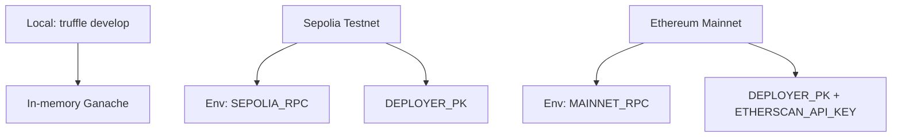

# Truffle Environment Guide


> Truffle is the deterministic build spine: local runs mirror GitHub Actions so deployment artefacts are predictable and auditable.

---

## Network Profiles



Configure RPC URLs and signer keys via environment variables; nothing sensitive is stored in the repository. Network definitions live in [`truffle-config.js`](../truffle-config.js) and share compiler settings with CI.

## Core Commands
| Action | Command | Notes |
| --- | --- | --- |
| Lint Solidity | `npm run lint:sol` | Solhint with zero warnings allowed (matches CI). |
| Compile contracts | `npm run compile` | Uses Truffle + Solidity 0.8.30 (viaIR, optimizer enabled). |
| Verify artifacts | `node scripts/verify-artifacts.js` | Confirms Truffle produced bytecode/ABI for all modules. |
| Governance audit | `npm run ci:governance` | Ensures owner/pauser surfaces exist and `$AGIALPHA` constants align with config. |
| Run migrations | `npx truffle migrate --network <profile>` | Use `--f 1 --to 3` for the production deployment sequence. |
| Launch console | `npx truffle develop` | Spins up an in-memory chain with the compiled artifacts. |
| Execute script | `npx truffle exec scripts/<file>.js --network <profile>` | Useful for post-deploy automation. |

## Artifact Hygiene
Artifacts land in `build/contracts/`. To regenerate from scratch:
```bash
rm -rf build/contracts
npm run compile
node scripts/verify-artifacts.js
```
Upload artefacts from CI (`Sovereign Compile` job) to auditors or downstream services as needed.

## Debugging Toolkit
- `truffle console --network <profile>` – inspect deployed contracts interactively.
- `truffle debug <txHash>` – step through transaction traces on supported networks.
- `truffle test` – reserved for unit/integration tests when added.
- `npx truffle version` – confirm Node/Truffle/Solidity versions; CI posts the same data in summaries.

## Deployment Alignment
- Always export `DEPLOY_CONFIG` before running migrations so scripts pull the correct configuration JSON.
- Use the [Deployment Runbook](../deploy/README.md) for the non-technical operator flow; Truffle commands above are the same ones that run in CI and during production broadcasts.
- `OwnerConfigurator` emits structured events for every governance mutation; keep it deployed even if you primarily control modules through Safe transactions.

Truffle remains the orchestration hub: deterministic compiles, reproducible migrations, and governance audits converge here before anything reaches mainnet.
