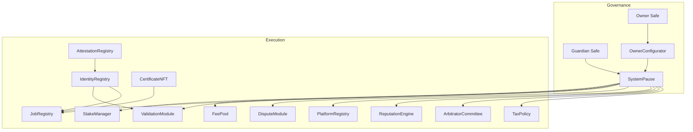
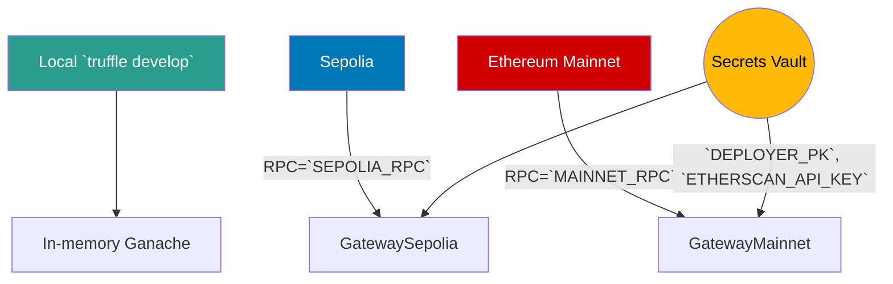

# Sovereign Labor – Truffle Command Nexus

[](https://github.com/agijobs/agijobs-sovereign-labor-v0p1/actions/workflows/ci.yml)
[](https://github.com/agijobs/agijobs-sovereign-labor-v0p1/actions/workflows/security.yml)
[](https://github.com/agijobs/agijobs-sovereign-labor-v0p1/actions/workflows/branch-checks.yml)


> Truffle remains the fastest path for non-technical operators: one command to compile, one to migrate, one to verify. This nexus keeps every instruction Safe-friendly and every artifact auditable.

---

## Table of Contents
1. [Mission Geometry](#mission-geometry)
2. [Network Topography](#network-topography)
3. [Toolchain Baseline](#toolchain-baseline)
4. [Command Matrix](#command-matrix)
5. [Mainnet Launch Playbook](#mainnet-launch-playbook)
6. [Post-Deployment Validation](#post-deployment-validation)
7. [Troubleshooting & Safeguards](#troubleshooting--safeguards)
8. [Reference Index](#reference-index)

---

## Mission Geometry


Truffle migrations wire this constellation deterministically: every contract reports to SystemPause, which obeys the owner Safe.

---

## Network Topography


Truffle reads networks from [`truffle-config.js`](../truffle-config.js). Node 20 LTS, `solc 0.8.30` (`viaIR`, optimizer runs 5), and `@truffle/hdwallet-provider` keep local and CI environments identical.

---

## Toolchain Baseline
| Component | Version | Verification |
| --- | --- | --- |
| Node.js | 20.x LTS | `node --version` |
| npm | 10.x | `npm --version` |
| Truffle | 5.11.5 | `npx truffle version` |
| solc | 0.8.30 (via IR) | `npx truffle version` output |
| HD Wallet Provider | `@truffle/hdwallet-provider` | Loaded automatically from `.env` |
| Foundry (optional) | Stable | `forge --version` for security workflows |

**Environment variables** (store in `.env`):
```bash
MAINNET_RPC="https://mainnet.infura.io/v3/<project>"
SEPOLIA_RPC="https://sepolia.infura.io/v3/<project>"
DEPLOYER_PK="0x<private-key>"
ETHERSCAN_API_KEY="<etherscan-token>"
```
Optional: set `DEPLOY_CONFIG` to point at a custom manifest.

---

## Command Matrix
| Intent | Command | Notes |
| --- | --- | --- |
| Compile | `npm run compile` | Produces Truffle artifacts with `solc 0.8.30` via IR. |
| Lint | `npm run lint:sol` | Zero-warning solhint policy. |
| Governance audit | `npm run ci:governance` | Confirms owner control surfaces and `$AGIALPHA` invariants. |
| Test | `npm run test:truffle:ci` | Runs tests without remigrating (uses compiled artifacts). |
| Mainnet deploy | `npm run deploy:truffle:mainnet` | Executes all migrations sequentially. |
| Contract verification | `npm run verify:mainnet` | Uses `truffle-plugin-verify` with Etherscan API key. |
| Treasury rotation | `NEW_TREASURY=0x... npx truffle exec scripts/owner-set-treasury.js --network mainnet` | Safe-ready calldata. |

---

## Mainnet Launch Playbook
1. **Preflight.** Complete the global checklist in [`deploy/README.md`](../deploy/README.md#preflight-checklist).
2. **Compile & audit.** Run `npm run compile`, `node scripts/verify-artifacts.js`, and `npm run ci:governance`.
3. **Execute migrations.**
   ```bash
   npm run deploy:truffle:mainnet
   ```
   - Step 1 deploys modules, binds `$AGIALPHA`, wires dependencies, and transfers ownership to SystemPause.
   - Step 2 verifies ownership census and registers guardian pauser.
   - Step 3 validates pointers, token metadata, and writes manifests.
4. **Accept identity ownerships** from the owner Safe UI.
5. **Verify contracts.** `npm run verify:mainnet` after Etherscan indexes the transactions.
6. **Archive manifests** under `manifests/` and record Safe transaction hashes.

---

## Post-Deployment Validation
| Check | Command | Expected Result |
| --- | --- | --- |
| Governance matrix | `npm run ci:governance -- --format table` | All modules owned by SystemPause or owner Safe as expected. |
| Pause authority | Etherscan: `SystemPause.owner()` & `SystemPause.activePauser()` | Owner Safe and guardian Safe addresses. |
| Treasury pointers | Etherscan: `StakeManager.treasury()`, `FeePool.treasury()` | Match manifest. |
| Token binding | Etherscan: `JobRegistry.agiToken()` | `0xa61a3b3a130a9c20768eebf97e21515a6046a1fa`. |
| Identity acceptance | Etherscan events for IdentityRegistry & AttestationRegistry | `OwnershipTransferred` logged to owner Safe. |

---

## Troubleshooting & Safeguards
| Symptom | Diagnosis | Resolution |
| --- | --- | --- |
| Migration reverts with `$AGIALPHA` mismatch | Manifest token changed or decimals incorrect. | Restore canonical address and ensure token decimals = 18. |
| Ownership census fails | Safe addresses incorrect in manifest. | Update manifest, rerun Step 1, then Step 2. |
| Guardian cannot pause | Guardian Safe not set in manifest. | Update manifest and rerun Step 1 or call `SystemPause.setGlobalPauser`. |
| `verify:mainnet` fails | Contracts not yet indexed on Etherscan. | Wait for indexing, ensure `ETHERSCAN_API_KEY` is set. |
| `owner-set-treasury` fails | Missing `NEW_TREASURY`. | Export environment variable before running script. |

---

## Reference Index
- [`truffle-config.js`](../truffle-config.js) – Compiler configuration, network RPCs, HD wallet provider wiring.
- [`migrations/`](../migrations) – Source of the migration scripts executed by `npm run deploy:truffle:mainnet`.
- [`scripts/`](../scripts) – Governance macros and manifest tooling reused by migrations.
- [`manifests/`](../manifests) – Deployment outputs; archive after each run.

With this nexus and the autopilot commands, a non-technical operator can deploy, pause, resume, and reconfigure the labor machine with total clarity.
