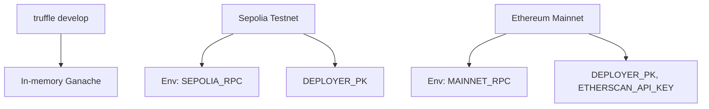

# Truffle Environment Guide

## Network Profiles


Profiles live in [`truffle-config.js`](../truffle-config.js). Each pulls RPC URLs and signer keys from environment variables so secrets never hit disk.

## Core Commands
| Action | Command |
| --- | --- |
| Compile with Solidity 0.8.30 (via IR) | `npm run compile` (same command invoked by the `Sovereign Compile` GitHub Action) |
| Launch local console | `npx truffle develop` |
| Execute migrations | `npx truffle migrate --network <profile>` |
| Run custom script | `npx truffle exec scripts/<file>.js --network <profile>` |
| Inspect contract | `truffle console --network <profile>` |

`migrations/1_deploy_kernel.js` expects `DEPLOY_CONFIG` to point at a JSON configuration (see [`deploy/README.md`](../deploy/README.md)). The migration automatically writes manifests under `manifests/` and enforces `$AGIALPHA`'s 18-decimal discipline at runtime.

## Artifact Hygiene
Compiled ABIs/bytecode live in `build/contracts/`. When modifying compiler settings or pulling fresh sources, clear the folder:
```bash
rm -rf build/contracts
npm run compile
```

## Debugging Toolkit
- `truffle debug <txHash>` – step through failed transactions.
- `truffle develop --log` – verbose EVM logging for local debugging.
- `truffle version` – confirm Node, Truffle, and Solidity versions match CI (Node 20.x / Truffle 5.11.5 / Solidity 0.8.30).

## Interop & Tooling
- The project ships with `@truffle/hdwallet-provider`; configure `DEPLOYER_PK` + RPC to sign mainnet/testnet transactions.
- Other frameworks (Hardhat, Foundry) can ingest the generated ABI/bytecode JSON artifacts for testing or verification.
- The migration emits manifests consumed by downstream infrastructure; keep them under version control or archive them alongside releases.

Treat the Truffle environment as the deterministic build & deployment spine—every run should mirror CI outputs to keep the sovereign labor machine reproducible.
