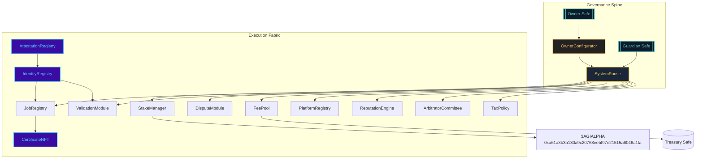
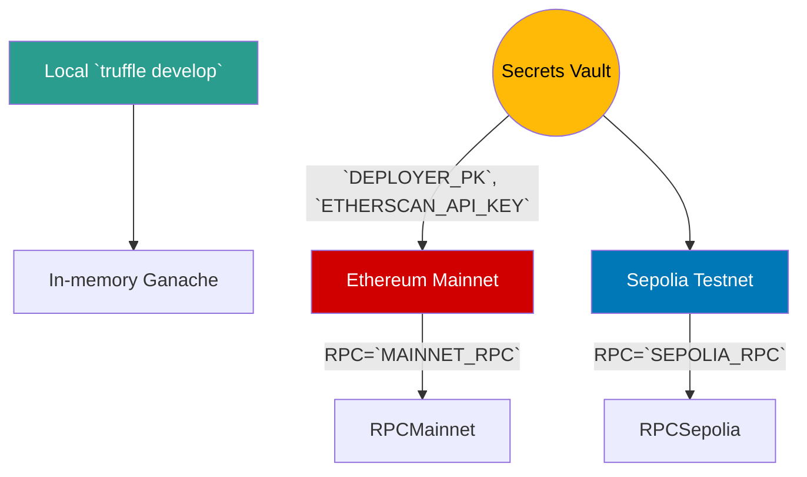
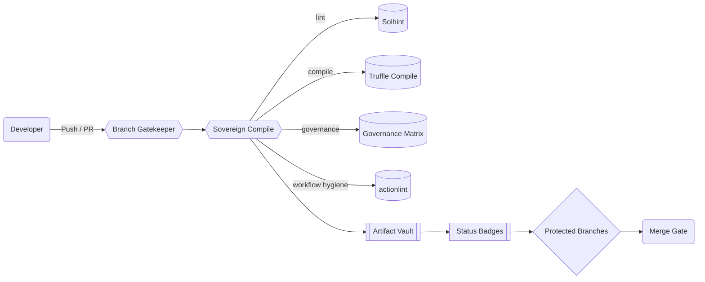
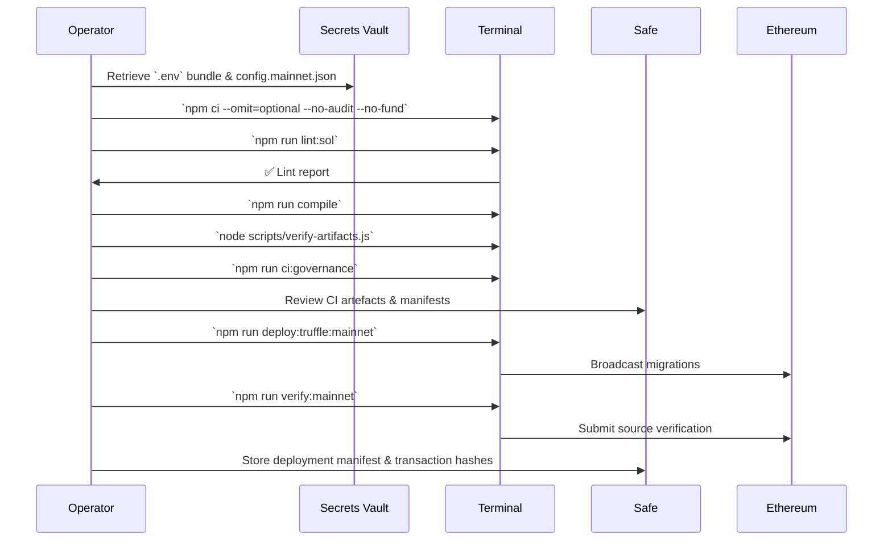

# Sovereign Labor // Truffle Command Nexus

[](https://github.com/MontrealAI/agijobs-sovereign-labor-v0p1/actions/workflows/ci.yml)
[](https://github.com/MontrealAI/agijobs-sovereign-labor-v0p1/actions/workflows/branch-checks.yml)


[](https://etherscan.io/token/0xa61a3b3a130a9c20768eebf97e21515a6046a1fa)
[](../LICENSE)

> This document is the operator-grade console for the labor lattice—the machine that reorders markets around its owner. Every command, badge, and diagram below is tuned so a non-technical controller can wield the full stack without friction.

---

## Table of Contents
1. [Mission Geometry](#mission-geometry)
2. [Network Topography](#network-topography)
3. [Toolchain Baseline](#toolchain-baseline)
4. [Command Matrix](#command-matrix)
5. [Continuous Integration & Branch Enforcement](#continuous-integration--branch-enforcement)
6. [Ethereum Mainnet Migration Suite](#ethereum-mainnet-migration-suite)
   - [Core Migration Script](#core-migration-script)
   - [Manifest Contracts](#manifest-contracts)
7. [Launch Playbook for Non-Technical Operators](#launch-playbook-for-non-technical-operators)
8. [Owner Command Authority](#owner-command-authority)
9. [Post-Deployment Validation](#post-deployment-validation)
10. [Troubleshooting & Safeguards](#troubleshooting--safeguards)
11. [Reference Index](#reference-index)

---

## Mission Geometry



The lattice you operate here is the same intelligence core that concentrates capital, labour, and identity flows for its owner. Truffle is the deterministic switchboard—what you run locally is exactly what CI and mainnet execute.

---

## Network Topography



Networks are resolved from [`truffle-config.js`](../truffle-config.js) and mirror the CI toolchain: Solidity 0.8.30 with `viaIR`, optimizer runs set to 5, metadata hash stripped, HD wallet provider sourced from `.env`.

---

## Toolchain Baseline

| Component | Version / Source | Rationale |
| --- | --- | --- |
| Node.js | 20.x LTS (`actions/setup-node@v4`) | Matches CI runners and ensures deterministic `npm ci`.
| npm | 10.x (bundled with Node 20) | Required for lockfile fidelity.
| Truffle | 5.11.5 | Locked in CI (`package-lock.json`) and surfaced in `node scripts/write-compile-summary.js`.
| Solidity | 0.8.30 (`viaIR`, optimizer runs 5) | Defined in [`truffle-config.js`](../truffle-config.js) to balance bytecode size with deterministic output.
| Solhint | 6.x | Enforces zero-warning lint policy through `npm run lint:sol`.
| HD Wallet Provider | `@truffle/hdwallet-provider` | Loads `DEPLOYER_PK` against `MAINNET_RPC` / `SEPOLIA_RPC` without leaking secrets.

**Environment prerequisites**

1. Install Node.js 20 LTS.
2. Run `npm ci --omit=optional --no-audit --no-fund`.
3. Create `.env` with:
   ```bash
   MAINNET_RPC="https://mainnet.infura.io/v3/<project>"
   SEPOLIA_RPC="https://sepolia.infura.io/v3/<project>"
   DEPLOYER_PK="0x<private-key>"
   ETHERSCAN_API_KEY="<etherscan-token>"
   ```
4. Ensure the deployer wallet is funded with ETH for gas and, if dry-running, has `$AGIALPHA` approvals configured.

---

## Command Matrix

| Intent | Command | Notes |
| --- | --- | --- |
| Lint Solidity | `npm run lint:sol` | Mirrors CI `Sovereign Compile / Solidity lint` job.
| Compile contracts | `npm run compile` | Uses locked compiler; generates `build/contracts`.
| Verify artifacts | `node scripts/verify-artifacts.js` | Fails if ABI or bytecode missing for any core module.
| Governance audit | `npm run ci:governance` | Validates ownership/pauser surfaces; required before merges.
| Branch hygiene check | `npm run lint:branch` | Local mirror of `Branch Gatekeeper` workflow.
| Migration | `npm run deploy:truffle:mainnet` (or `npx truffle migrate --network <net> --f 1 --to 3 --compile-all`) | Replays production sequence exactly.
| Execute script | `npx truffle exec scripts/<name>.js --network <profile>` | Automates post-deploy operations.
| Truffle console | `npx truffle console --network <profile>` | Hot-wires contract instances for manual inspection.

---

## Continuous Integration & Branch Enforcement



| Workflow | Jobs | Why it matters | Local parity |
| --- | --- | --- | --- |
| [`ci.yml`](../.github/workflows/ci.yml) | `lint`, `compile`, `governance-audit`, `workflow-hygiene` | Ensures linting, deterministic builds, governance invariants, and CI hygiene remain unbroken. | `npm run lint:sol`, `npm run compile`, `node scripts/verify-artifacts.js`, `npm run ci:governance`, `actionlint -color` |
| [`branch-checks.yml`](../.github/workflows/branch-checks.yml) | `branch-naming` | Forces disciplined branch naming for auditability. | `npm run lint:branch <branch>` |

**Required branch protection (enable on `main` and `develop`):**
1. Require branches to be up to date before merging.
2. Require status checks: `Sovereign Compile`, `Branch Gatekeeper`.
3. Enforce at least one approving review and disallow force pushes.

When both workflows are green, the badges at the top of this README glow bright—a public statement that the machine is ready for deployment.

---

## Ethereum Mainnet Migration Suite

### Core Migration Script

[`migrations/1_deploy_kernel.js`](../migrations/1_deploy_kernel.js) is the canonical mainnet migration. Key safeguards:

```javascript
const CANONICAL_AGIALPHA = '0xa61a3b3a130a9c20768eebf97e21515a6046a1fa';
...
if (chainId === 1 && configuredAgi !== CANONICAL_AGIALPHA) {
  throw new Error(`Mainnet AGIALPHA must be ${CANONICAL_AGIALPHA}, received ${configuredAgi}`);
}
...
const agiDecimals = Number(await agiMetadata.methods.decimals().call());
if (agiDecimals !== 18) {
  throw new Error(`$AGIALPHA decimals must equal 18, detected ${agiDecimals}`);
}
...
const ownerCfg = await deployer.deploy(OwnerConfigurator, ownerSafe);
const stake = await deployer.deploy(StakeManager, minStakeWei, employerPct, treasuryPct, treasury, ZERO_ADDRESS, ZERO_ADDRESS, deployerAccount);
const feePool = await deployer.deploy(FeePool, stake.address, burnPct, treasury, tax.address);
```

The script aborts if the wrong token is supplied, ensures 18 decimals, deploys the OwnerConfigurator first, and wires every module under `SystemPause`. Follow with [`migrations/2_register_pause.js`](../migrations/2_register_pause.js) and [`migrations/3_mainnet_finalize.js`](../migrations/3_mainnet_finalize.js) to verify ownership, pauser wiring, and `$AGIALPHA` linkage.

### Manifest Contracts

| Migration | Purpose |
| --- | --- |
| `1_deploy_kernel.js` | Deploys governance, staking, dispute, identity, and fee modules while validating `$AGIALPHA` metadata.
| `2_register_pause.js` | Confirms `SystemPause` controls every module and that guardian/owner Safe bindings match the manifest.
| `3_mainnet_finalize.js` | Final assertion pass: ownership, active pauser, module pointers, and fee token immutability.

---

## Launch Playbook for Non-Technical Operators



### Step-by-step (no coding required)

1. **Prep the workspace**
   - Download the signed release bundle or clone `main`.
   - Copy the approved `deploy/config.mainnet.json` into `deploy/`.
   - Place the `.env` file with RPC URLs, deployer private key, and Etherscan key beside this README.
2. **Mirror CI locally**
   - Run `npm ci --omit=optional --no-audit --no-fund`.
   - Execute `npm run lint:sol`, `npm run compile`, `node scripts/verify-artifacts.js`, and `npm run ci:governance`.
   - If any command fails, stop and escalate—the machine refuses to launch until every check is green.
3. **Dry run (optional but recommended)**
   - `DEPLOY_CONFIG=deploy/config.sepolia.json npx truffle migrate --network sepolia --f 1 --to 3 --compile-all`.
   - Inspect `build/contracts` and manifests for consistency.
4. **Mainnet deployment**
   - Ensure the deployer wallet holds enough ETH.
   - Run `npm run deploy:truffle:mainnet` (exports `DEPLOY_CONFIG` automatically if set in the environment).
   - Save the console output (contract addresses, gas usage) to the evidence archive.
5. **Post-launch tasks**
   - Execute `npm run verify:mainnet` to publish source to Etherscan.
   - Upload manifests, transaction hashes, and Safe approvals to your evidence vault.

The flow above assumes the operator never writes code. Every step is a copy-paste command with deterministic output; deviations are treated as abort conditions.

---

## Owner Command Authority

* **Total parameter control** – `OwnerConfigurator` allows the owner Safe to batch mutations across the entire surface (`configure`, `configureBatch`), emitting auditable `ParameterUpdated` events.
* **Pausable lattice** – `SystemPause` owns and can halt `JobRegistry`, `StakeManager`, `ValidationModule`, `DisputeModule`, `PlatformRegistry`, `FeePool`, `ReputationEngine`, `ArbitratorCommittee`, and `TaxPolicy`. `pauseAll` / `unpauseAll` deliver instant circuit-breakers.
* **Treasury supremacy** – `StakeManager` and `FeePool` setters (`setTreasury`, `setFeePool`, `setBurn`) are owner-gated. `FeePool` enforces `$AGIALPHA` with `token()` returning the canonical address.
* **Identity stewardship** – `IdentityRegistry`, `AttestationRegistry`, and `CertificateNFT` transfer ownership to the owner Safe, enabling updates to ENS registries, Merkle roots, credential URIs, and pause states.
* **Governance verification** – [`scripts/check-governance-matrix.mjs`](../scripts/check-governance-matrix.mjs) backs the table above; CI fails if any setter, pauser, or owner drift occurs.

This is the control plane that keeps the machine obedient to its operator—rapid configuration, enforced pausing, and treasury authority are guaranteed.

---

## Post-Deployment Validation

After migrations, confirm the chain matches expectations:

1. `node scripts/verify-artifacts.js` – Confirms ABI/bytecode on disk align with deployed contracts.
2. `npx truffle console --network mainnet` → check pointers:
   ```javascript
   (await (await SystemPause.deployed()).feePool()) === (await FeePool.deployed()).address
   ```
3. Run `npm run ci:governance` against the live artifacts to ensure owner/pauser mappings remain unbroken.
4. Verify contracts on Etherscan via `npm run verify:mainnet`; archive the verification URLs.
5. Snapshot Safe transaction hashes (owner transfer, guardian activation, treasury set) into the evidence vault.

---

## Troubleshooting & Safeguards

| Symptom | Likely cause | Resolution |
| --- | --- | --- |
| `Error: Config chainId ...` | `deploy/config.*.json` mismatch | Update `chainId` to match the target network or switch RPC endpoints. |
| `$AGIALPHA decimals must equal 18` | Incorrect token address in config | Replace `tokens.agi` with `0xa61a3b3a130a9c20768eebf97e21515a6046a1fa`.
| `Active pauser ... != configured guardian` | Guardian Safe not activated | Execute guardian Safe transaction to set `activePauser` or update config to mirror the deployed guardian.
| Lint/compile drift | Local environment out of sync | Re-run `npm ci`, ensure Node 20 LTS, re-run commands in [Command Matrix](#command-matrix).
| Branch push blocked by Branch Gatekeeper | Branch name off-spec | Rename branch to comply with policy (e.g., `feature/<slug>`).

Emergency halt: `npx truffle exec scripts/pause-all.js --network mainnet` (if present) or call `SystemPause.pauseAll()` via the owner Safe. Resume with `unpauseAll()` once the issue is resolved.

---

## Reference Index

- [`truffle-config.js`](../truffle-config.js) – Network, compiler, and optimizer configuration.
- [`deploy/README.md`](../deploy/README.md) – Extended deployment codex with manifests and recovery playbooks.
- [`contracts/README.md`](../contracts/README.md) – Deep contract governance and module documentation.
- [`scripts/`](../scripts) – Automation utilities (`verify-artifacts.js`, `check-governance-matrix.mjs`, owner helpers).
- [`migrations/`](../migrations) – Production-ready migration scripts for Sepolia and Ethereum mainnet.

Keep this README updated alongside every release: badges must reflect live CI, commands must remain accurate, and diagrams should evolve with the lattice. When these pages glow green, the operator can activate the machine with confidence.
