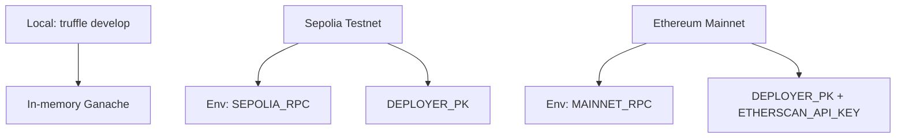

# Truffle Environment Guide


> Truffle is the deterministic build spine: local runs, CI, and production migrations all use this exact toolchain.

---

## Network Profiles



Network configuration lives in [`truffle-config.js`](../truffle-config.js) and mirrors the CI compiler settings (Solidity 0.8.30, optimizer on, viaIR enabled, metadata stripped).

## Core Commands

| Action | Command | Notes |
| --- | --- | --- |
| Lint Solidity | `npm run lint:sol` | Solhint with zero warnings allowed (CI identical). |
| Compile contracts | `npm run compile` | Truffle compile using the locked compiler version. |
| Verify artifacts | `node scripts/verify-artifacts.js` | Confirms bytecode/ABI exist for every core module. |
| Governance audit | `npm run ci:governance` | Fails if owner/pauser surfaces or `$AGIALPHA` constants drift. |
| Run migrations | `npx truffle migrate --network <profile>` | Use `--f 1 --to 3 --compile-all` for the production sequence. |
| Launch console | `npx truffle develop` | In-memory chain seeded with compilation artifacts. |
| Execute script | `npx truffle exec scripts/<file>.js --network <profile>` | Handy for post-deploy automation. |

## Artifact Hygiene

```bash
rm -rf build/contracts
npm run compile
node scripts/verify-artifacts.js
```

Truffle build artifacts are uploaded from CI (`Sovereign Compile` job) so auditors and operators can inspect them without rebuilding.

## Debugging Toolkit

- `truffle console --network <profile>` – Interactive console with contract instances.
- `truffle debug <txHash>` – Step through transaction traces on supported networks.
- `truffle test` – Reserved for unit/integration tests (future addition).
- `npx truffle version` – Prints toolchain versions; CI posts the same data in step summaries.

## Deployment Alignment

1. Export `DEPLOY_CONFIG` to point at the intended JSON configuration.
2. Run `npm run lint:sol`, `npm run compile`, `node scripts/verify-artifacts.js`, and `npm run ci:governance` locally; CI must match.
3. Broadcast with `npx truffle migrate --network mainnet --f 1 --to 3 --compile-all --skip-dry-run` (see [Deployment Runbook](../deploy/README.md)).
4. Use `OwnerConfigurator` (deployed in migration `1_deploy_kernel.js`) for Safe-friendly parameter updates post-launch.

Truffle remains the orchestration hub: deterministic compiles, reproducible migrations, and governance audits converge here before anything reaches mainnet.
